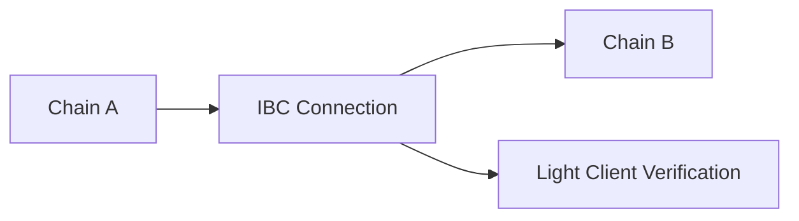

# IBC Fundamentals

The **Inter-Blockchain Communication (IBC) protocol** is the foundation of Polymer's interoperability capabilities. Originally developed for the Cosmos ecosystem, IBC enables secure, trustless communication between independent blockchain networks.

## What is IBC?

IBC is a **general-purpose protocol** that allows different blockchains to communicate with each other in a trustless manner. Think of it as the "TCP/IP for blockchains" - a standardized way for blockchain networks to send messages and transfer assets.

<Info>
  IBC was first implemented in the Cosmos SDK and has facilitated billions of dollars in cross-chain transfers across the Cosmos ecosystem.
</Info>

## Key Features

<CardGroup cols={2}>
  <Card title="Trustless Communication" icon="shield-check">
    No need for trusted intermediaries - cryptographic proofs ensure security
  </Card>
  
  <Card title="General Purpose" icon="puzzle">
    Support for any type of cross-chain message, not just token transfers
  </Card>
  
  <Card title="Composable" icon="cubes">
    Applications can be built across multiple chains seamlessly
  </Card>
  
  <Card title="Battle Tested" icon="check-double">
    Proven security model with billions in cross-chain value transferred
  </Card>
</CardGroup>

## How IBC Works

IBC operates through a series of standardized message types and cryptographic proofs:

### 1. Connection Establishment



Chains establish connections through:
- **Light client creation** on each chain
- **Connection handshakes** to verify counterparty chains
- **Channel establishment** for specific application protocols

### 2. Message Passing

When sending a cross-chain message:

<Steps>
  <Step title="Message Commitment">
    The source chain commits to sending a message and generates a cryptographic proof
  </Step>
  
  <Step title="Proof Generation">
    A proof is created that demonstrates the message was committed on the source chain
  </Step>
  
  <Step title="Verification">
    The destination chain verifies the proof using its light client of the source chain
  </Step>
  
  <Step title="Execution">
    If verification succeeds, the message is executed on the destination chain
  </Step>
</Steps>

## IBC vs Other Cross-Chain Solutions

| Feature | IBC | Typical Bridges |
|---------|-----|-----------------|
| **Security Model** | Trustless cryptographic proofs | Often requires trusted validators |
| **Generality** | Any message type | Usually limited to token transfers |
| **Composability** | Native cross-chain apps | Limited composability |
| **Upgrades** | Modular, upgradeable | Often monolithic |

## IBC Applications

IBC supports various application types through standardized interfaces:

<Tabs>
  <Tab title="Token Transfers">
    **ICS-20** - Fungible token transfers between chains
    
    ```solidity
    // Example: Transfer tokens from Chain A to Chain B
    transfer(
      sourcePort: "transfer",
      sourceChannel: "channel-0", 
      token: { denom: "uatom", amount: "1000000" },
      sender: "cosmos1...",
      receiver: "0x123...",
      timeoutHeight: { revisionNumber: 1, revisionHeight: 1000 }
    )
    ```
  </Tab>
  
  <Tab title="NFT Transfers">
    **ICS-721** - Non-fungible token transfers
    
    ```solidity
    // Transfer an NFT across chains
    nftTransfer(
      sourcePort: "nft-transfer",
      sourceChannel: "channel-1",
      classId: "cryptokitties",
      tokenId: "kitty-123",
      sender: "cosmos1...",
      receiver: "0x456..."
    )
    ```
  </Tab>
  
  <Tab title="Interchain Accounts">
    **ICS-27** - Control accounts on remote chains
    
    ```solidity
    // Execute transaction on remote chain
    sendTx(
      connectionId: "connection-0",
      owner: "cosmos1...",
      msgs: [/* transaction messages */]
    )
    ```
  </Tab>
</Tabs>

## Security Guarantees

IBC provides several important security properties:

### Packet Ordering
- **Ordered channels**: Messages arrive in the order they were sent
- **Unordered channels**: Messages can arrive in any order, improving performance

### Timeout Protection
- Messages include timeout conditions
- Prevents funds from being locked indefinitely
- Enables rollback if delivery fails

### Light Client Security
- Each chain maintains light clients of its counterparty chains
- Cryptographic verification without running full nodes
- Regular updates maintain security as chains progress

<Warning>
  The security of IBC is only as strong as the light client implementations. Polymer uses advanced light client technology to ensure maximum security.
</Warning>

## Virtual IBC on Ethereum

Polymer brings IBC to Ethereum through **Virtual IBC** - a novel implementation that makes IBC work on EVM-compatible chains:

<Card title="Learn about Virtual IBC" icon="arrow-right" href="/concepts/virtual-ibc">
  Discover how Polymer implements IBC on Ethereum and other EVM chains
</Card>

---

<Info>
  **Next Steps**: Now that you understand IBC fundamentals, explore [Virtual IBC](/concepts/virtual-ibc) to see how Polymer brings this powerful protocol to Ethereum.
</Info> 