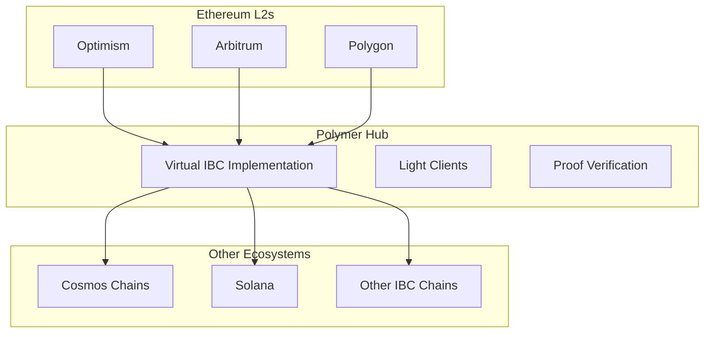

# Virtual IBC

**Virtual IBC** is Polymer's groundbreaking innovation that brings the Inter-Blockchain Communication (IBC) protocol to Ethereum and other EVM-compatible chains. This enables Ethereum Layer 2s to communicate with each other and with other blockchain ecosystems using the proven IBC standard.

## The Challenge

Traditional IBC was designed for Cosmos SDK chains which have built-in IBC support. Ethereum and its Layer 2s face several challenges in implementing IBC:

<CardGroup cols={2}>
  <Card title="State Model Differences" icon="database">
    Ethereum uses account-based state while Cosmos uses UTXO-like state tracking
  </Card>
  
  <Card title="Block Structure" icon="cube">
    Different block formats and proof systems between EVM and Cosmos chains
  </Card>
  
  <Card title="Light Client Complexity" icon="eye">
    EVM chains need specialized light clients for verification
  </Card>
  
  <Card title="Gas Efficiency" icon="gas-pump">
    IBC operations must be gas-efficient for practical adoption
  </Card>
</CardGroup>

## Polymer's Solution

Virtual IBC abstracts away these complexities by creating a **virtualization layer** that makes EVM chains IBC-compatible:



## Key Components

### 1. IBC Smart Contracts

Polymer deploys IBC implementation as smart contracts on each supported chain:

```solidity
// Core IBC contract structure
contract IBCHandler {
    // Client management
    mapping(string => IBCClient) public clients;
    
    // Connection management  
    mapping(string => IBCConnection) public connections;
    
    // Channel management
    mapping(string => IBCChannel) public channels;
    
    // Packet handling
    function sendPacket(Packet packet) external;
    function recvPacket(Packet packet, bytes proof) external;
    function acknowledgePacket(Packet packet, bytes proof) external;
}
```

### 2. Light Client Integration

Each chain runs light clients of its counterparty chains:

<Tabs>
  <Tab title="Tendermint Light Client">
    For connecting to Cosmos chains
    
    ```solidity
    contract TendermintLightClient {
        struct ConsensusState {
            uint64 timestamp;
            bytes32 root;
            bytes nextValidatorsHash;
        }
        
        function verifyProof(
            bytes memory proof,
            bytes memory path,
            bytes memory value
        ) external view returns (bool);
    }
    ```
  </Tab>
  
  <Tab title="Ethereum Light Client">
    For EVM chain verification
    
    ```solidity
    contract EthereumLightClient {
        struct BlockHeader {
            bytes32 parentHash;
            bytes32 stateRoot;
            uint256 number;
            uint256 timestamp;
        }
        
        function verifyStorageProof(
            bytes32 blockHash,
            address account,
            bytes32 slot,
            bytes memory proof
        ) external view returns (bytes32);
    }
    ```
  </Tab>
</Tabs>

### 3. Proof Generation and Verification

Virtual IBC handles different proof formats:

#### Storage Proofs
For EVM chains, Polymer uses Merkle Patricia Trie proofs:

```javascript
// Generate storage proof for EVM chain
const proof = await ethProvider.getProof(
  contractAddress,
  [storageKey],
  blockNumber
);

// Verify on destination chain
const verified = await lightClient.verifyStorageProof(
  blockHash,
  contractAddress, 
  storageKey,
  proof.storageProof
);
```

#### State Proofs  
For Cosmos chains, IAVL tree proofs are used:

```go
// Generate IAVL proof
proof, err := store.GetMembershipProof(key)

// Verify proof
valid := clientState.VerifyMembership(
    proof,
    path,
    value
)
```

## Virtual IBC Architecture

The Virtual IBC system consists of several layers:

### Application Layer
Applications use standard IBC interfaces:

```solidity
interface IIBCApplication {
    function onRecvPacket(
        Packet memory packet,
        address relayer
    ) external returns (bytes memory acknowledgement);
    
    function onAcknowledgePacket(
        Packet memory packet,
        bytes memory acknowledgement,
        address relayer
    ) external;
    
    function onTimeoutPacket(
        Packet memory packet,
        address relayer  
    ) external;
}
```

### Core IBC Layer
Handles connections, channels, and packet routing:

<Steps>
  <Step title="Client Creation">
    Deploy and initialize light clients for counterparty chains
  </Step>
  
  <Step title="Connection Handshake">
    Establish verified connections between chains
  </Step>
  
  <Step title="Channel Creation">
    Open application-specific channels
  </Step>
  
  <Step title="Packet Flow">
    Handle packet lifecycle: send → receive → acknowledge
  </Step>
</Steps>

### Transport Layer
Manages the underlying blockchain interactions and proof systems.

## Benefits of Virtual IBC

<CardGroup cols={2}>
  <Card title="EVM Compatibility" icon="ethereum">
    Works with any EVM-compatible chain without modifications
  </Card>
  
  <Card title="Standard Interface" icon="plug">
    Uses the same IBC interfaces as Cosmos chains
  </Card>
  
  <Card title="Modular Design" icon="puzzle">
    Components can be upgraded independently
  </Card>
  
  <Card title="Gas Optimized" icon="zap">
    Efficient implementation for practical usage
  </Card>
</CardGroup>

## Supported Operations

Virtual IBC supports the full range of IBC operations:

### Token Transfers (ICS-20)
```solidity
// Transfer tokens across chains
function transfer(
    string memory sourcePort,
    string memory sourceChannel,
    Token memory token,
    address sender,
    string memory receiver,
    Height memory timeoutHeight,
    uint64 timeoutTimestamp
) external;
```

### NFT Transfers (ICS-721)
```solidity
// Transfer NFTs across chains  
function nftTransfer(
    string memory sourcePort,
    string memory sourceChannel,
    string memory classId,
    string memory tokenId,
    address sender,
    string memory receiver,
    Height memory timeoutHeight,
    uint64 timeoutTimestamp
) external;
```

### Interchain Accounts (ICS-27)
```solidity
// Execute transactions on remote chains
function sendTx(
    string memory connectionId,
    address owner,
    bytes[] memory msgs,
    uint64 timeoutTimestamp
) external;
```

## Security Considerations

Virtual IBC maintains the same security guarantees as traditional IBC:

<Warning>
  **Light Client Security**: The security model depends on the light client implementations. Polymer uses rigorously tested and audited light clients.
</Warning>

### Key Security Properties:

- **Cryptographic Verification**: All cross-chain messages are cryptographically verified
- **Timeout Protection**: Messages include timeout conditions to prevent indefinite locks
- **Atomic Operations**: Operations either complete fully or fail completely
- **Fraud Proofs**: Invalid state transitions can be challenged

## Getting Started

Ready to build with Virtual IBC? Check out our build guides:

<CardGroup cols={2}>
  <Card title="Build Overview" icon="hammer" href="/build/overview">
    Learn how to start building with Polymer's Virtual IBC
  </Card>
  
  <Card title="Interop Contracts" icon="file-contract" href="/build/interop-contracts">
    Write smart contracts that communicate across chains
  </Card>
</CardGroup>

---

<Info>
  **Next**: Explore Polymer's [Architecture](/concepts/architecture) to understand how all these components work together.
</Info> 