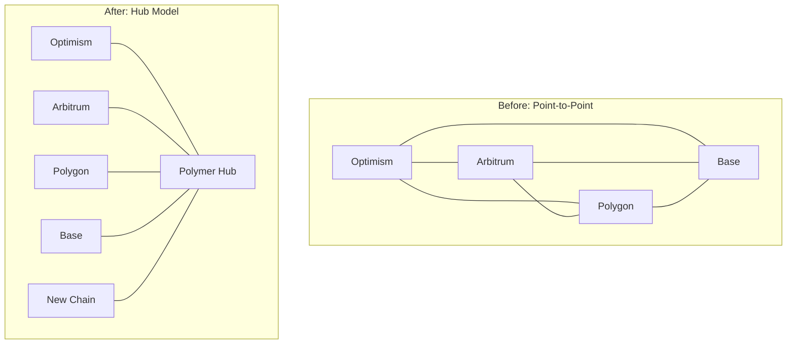

# Why Polymer?

The blockchain ecosystem is becoming increasingly **multi-chain**, with numerous Layer 2 solutions, app-specific chains, and specialized networks. However, these chains exist in isolation, creating **fragmented liquidity**, **poor user experience**, and **limited composability**. Polymer solves these fundamental problems.

## The Multi-Chain Reality

<CardGroup cols={2}>
  <Card title="Fragmented Ecosystem" icon="puzzle">
    Assets and users are scattered across dozens of chains, reducing network effects
  </Card>
  
  <Card title="Poor User Experience" icon="face-frown">
    Users must manage multiple wallets, bridges, and gas tokens for different chains
  </Card>
  
  <Card title="Limited Composability" icon="ban">
    DeFi protocols can't leverage liquidity or functionality from other chains
  </Card>
  
  <Card title="Security Risks" icon="triangle-exclamation">
    Custom bridges introduce new attack vectors and trusted assumptions
  </Card>
</CardGroup>

## How Polymer Helps

Polymer addresses these challenges by creating **Ethereum's interoperability hub** - a unified layer that connects all of Ethereum's Layer 2 ecosystem through the proven IBC protocol.

### 🌉 Universal Connectivity

Instead of building point-to-point bridges between every pair of chains, Polymer creates a **hub-and-spoke model**:



**Benefits:**
- **N connections instead of N²**: Adding a new chain requires only one connection to Polymer
- **Standardized interface**: All chains use the same IBC protocol
- **Network effects**: Every new chain increases value for all existing chains

### 🔒 Battle-Tested Security

Polymer uses the **IBC protocol**, which has:

<Columns cols={2}>
  <div>
    ### Proven Track Record
    - **$50+ billion** in cross-chain value transferred
    - **Zero protocol-level exploits** since launch
    - **3+ years** of production usage in Cosmos
    - **Rigorous formal verification** of core components
  </div>
  
  <div>
    ### Technical Advantages
    - **Cryptographic proofs** instead of trusted validators
    - **Light client verification** for trustless operation
    - **Timeout mechanisms** prevent stuck transactions
    - **Modular design** allows for upgrades and improvements
  </div>
</Columns>

### ⚡ Enhanced User Experience

With Polymer, users experience seamless cross-chain interactions:

<Tabs>
  <Tab title="Asset Transfers">
    **Unified Asset Movement**
    
    ```typescript
    // Send USDC from Optimism to Arbitrum
    await polymer.transfer({
      from: 'optimism',
      to: 'arbitrum', 
      token: 'USDC',
      amount: '1000',
      recipient: '0x123...'
    });
    ```
    
    - No need to find and trust custom bridges
    - Consistent interface across all chains
    - Automatic route optimization
  </Tab>
  
  <Tab title="Cross-Chain DeFi">
    **Composable Applications**
    
    ```typescript
    // Lend on Aave (Polygon) and borrow against collateral on Compound (Optimism)
    await crossChainDefi.execute({
      actions: [
        { chain: 'polygon', protocol: 'aave', action: 'supply', asset: 'USDC', amount: '10000' },
        { chain: 'optimism', protocol: 'compound', action: 'borrow', asset: 'ETH', amount: '2' }
      ]
    });
    ```
    
    - Access liquidity from multiple chains
    - Create strategies spanning entire ecosystem
    - Unified cross-chain positions
  </Tab>
  
  <Tab title="Multi-Chain Apps">
    **Native Interoperability**
    
    ```solidity
    // Contract on Optimism that uses data from Arbitrum
    contract CrossChainOracle {
        function updatePrice() external {
            // Fetch price from Arbitrum oracle
            bytes memory priceData = IBC.call(
                "arbitrum",
                "price-oracle", 
                abi.encodeCall(PriceOracle.getPrice, ("ETH"))
            );
            
            uint256 price = abi.decode(priceData, (uint256));
            emit PriceUpdated(price);
        }
    }
    ```
  </Tab>
</Tabs>

## Key Benefits for Different Stakeholders

### For Developers

<CardGroup cols={2}>
  <Card title="Unified Development" icon="code">
    Single SDK and interface for all supported chains
  </Card>
  
  <Card title="Expanded Market" icon="chart-line">
    Access users and liquidity from entire Ethereum ecosystem
  </Card>
  
  <Card title="Composability" icon="cubes">
    Build applications that span multiple chains natively
  </Card>
  
  <Card title="Future-Proof" icon="shield">
    Standard protocol that works with new chains automatically
  </Card>
</CardGroup>

### For Users

<CardGroup cols={2}>
  <Card title="Simplified Experience" icon="smile">
    Seamless movement between chains without learning new interfaces
  </Card>
  
  <Card title="Better Capital Efficiency" icon="coins">
    Access best yields and opportunities across all chains
  </Card>
  
  <Card title="Reduced Fragmentation" icon="link">
    Unified experience across the entire Ethereum ecosystem
  </Card>
  
  <Card title="Enhanced Security" icon="shield-check">
    Battle-tested protocol with proven security guarantees
  </Card>
</CardGroup>

### For Protocols

<CardGroup cols={2}>
  <Card title="Network Effects" icon="network-wired">
    Every new chain integration benefits all existing protocols
  </Card>
  
  <Card title="Composability" icon="puzzle">
    Leverage functionality and liquidity from other chains
  </Card>
  
  <Card title="User Acquisition" icon="users">
    Access users from any connected chain
  </Card>
  
  <Card title="Competitive Advantage" icon="trophy">
    First-mover advantage in cross-chain native applications
  </Card>
</CardGroup>

## Comparison with Alternatives

| Solution | Security Model | Generality | Composability | Ecosystem |
|----------|----------------|------------|---------------|-----------|
| **Polymer (IBC)** | Cryptographic proofs | Any message type | Native cross-chain apps | Growing rapidly |
| **Canonical Bridges** | Chain security | Limited to specific tokens | Poor | Fragmented |
| **Trusted Bridges** | External validators | Variable | Limited | Risky |
| **Atomic Swaps** | Cryptographic | Token swaps only | None | Limited |

## The Vision: Ethereum as One

Polymer's ultimate goal is to make **Ethereum's Layer 2 ecosystem feel like a single, unified network**:

- **Unified liquidity** across all Layer 2s
- **Seamless user experience** regardless of which chain they start on  
- **Composable applications** that leverage the entire ecosystem
- **Network effects** that benefit all participants

<Card title="Learn More About IBC" icon="arrow-right" href="/why-polymer/ibc-protocol">
  Discover why IBC is the optimal protocol for cross-chain communication
</Card>

---

<Info>
  **Ready to build the multi-chain future?** Start with our [quickstart guide](/quickstart) or dive into the [core concepts](/concepts/introduction).
</Info> 